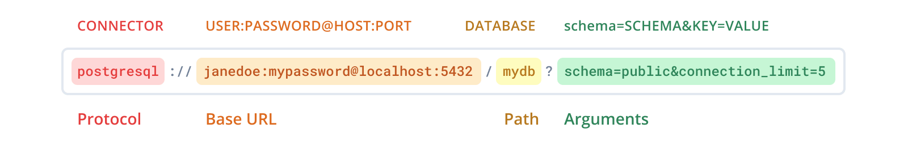

# DataBase drivers

This package contains the database drivers for use in ShortLink services.

### Selecting a driver

A driver is selected at runtime through `STORE_TYPE`, and is made available at
compile time by importing its package for the side effect:

```go
import (
    "github.com/shortlink-org/go-sdk/db"
    _ "github.com/shortlink-org/go-sdk/db/drivers/postgres"
)

store, err := db.New(ctx, log, tracer, metrics, cfg)
```

Only the drivers you import are linked into the binary. Importing every driver
costs ~30 MB of binary and pulls in cgo through `mattn/go-sqlite3`, so the list
is opt-in rather than automatic.

`ram` is dependency-free, backs the default `STORE_TYPE`, and is always
registered — it needs no import.

An unrecognised `STORE_TYPE` fails `db.New` with `UnknownStoreTypeError`; it
does **not** fall back to the in-memory store. The error lists the drivers that
are registered, which distinguishes a typo from a missing blank import.

### Available drivers

`aerospike`, `badger`, `clickhouse`, `cockroachdb`, `couchbase`, `dgraph`,
`edgedb`, `etcd`, `leveldb`, `mongo`, `mysql`, `neo4j`, `postgres`, `ram`,
`redis`, `scylladb`, `sqlite`.

The [postgres driver](./drivers/postgres/) additionally routes reads to a
streaming replica without giving up read-your-writes — see
[ADR 0001](./drivers/postgres/ADR/0001-read-replica-routing.md).

### Driver-specific options

Most configuration arrives through `*config.Config`, but some cannot be spelled
as a string — a callback, a prepared client, a custom TLS config. A driver
exposes those through its own `With`, so client code stays typed and never
names the driver:

```go
store, err := db.New(ctx, log, tracer, metrics, cfg,
    postgres.With(postgres.WithAfterConnect(fn)),
)
```

The options apply only when `STORE_TYPE` selects that driver; options for
another registered driver are ignored, so one binary can carry the wiring for
several deployments. Options addressed to a driver that is **not** registered
fail `db.New` with `UnknownOptionTargetError` — an option that could never be
applied is a wiring mistake, not a no-op.

A driver offers this by wrapping the `db.DriverOption` seam:

```go
func With(opts ...Option) db.Option {
    boxed := make([]any, 0, len(opts))
    for _, opt := range opts {
        boxed = append(boxed, opt)
    }

    return db.DriverOption(driverName, boxed...)
}
```

### Getting the connection

`Conn` returns the driver connection as its concrete type, and reports
`ErrGetConnection` when the driver in use is not the expected one:

```go
pool, err := db.Conn[*pgxpool.Pool](store)
if err != nil {
    return err
}
```

### Adding a driver

Implement `db.DB` (`Init(ctx) error` and `GetConn() any`), then register the
driver from its own package:

```go
//nolint:gochecknoinits // driver registration
func init() {
    db.Register("mydriver", func(deps db.Deps) (db.DB, error) {
        return New(deps.Cfg), nil
    })
}
```

A driver that cannot register — a duplicate name or a nil factory — is recorded
and reported by `db.New` as `RegisterError`, so a collision surfaces instead of
silently shadowing a driver. Registration happens in `init`, where there is no
caller to return an error to, so nothing panics: the failure waits until there
is someone to hand it to.

### Errors

Two lifecycle error types live in `db` and every driver aliases them, so a
caller can match once and be right about all sixteen:

```go
var storeErr *db.StoreError
if errors.As(err, &storeErr) {
    log.Error("store failed", "driver", storeErr.Driver, "op", storeErr.Op)
}
```

`StoreError` names the store, the phase it failed in, and wraps the cause;
`PingConnectionError` reports a connection that came up but did not answer a
ping. Both unwrap, so `errors.Is(err, context.Canceled)` still works through
them — which is how a caller tells a shutdown from a server that is down.

Each driver keeps its own sentinels (`postgres.ErrInvalidCredentials`,
`redis.ErrInvalidURI`, …); only the envelope is shared.

### URI format

We use the following format for the database URI:



### Graceful shutdown

Safely terminate database interactions by closing the associated Context:

  ```go
  ctx, cancel := context.WithTimeout(context.Background(), 5*time.Second)
  defer cancel()
  // Utilize ctx in your database tasks
  ```
