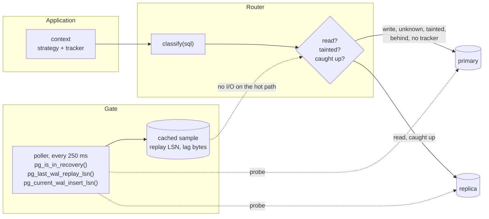
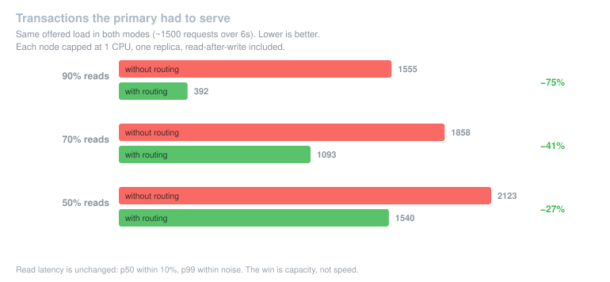
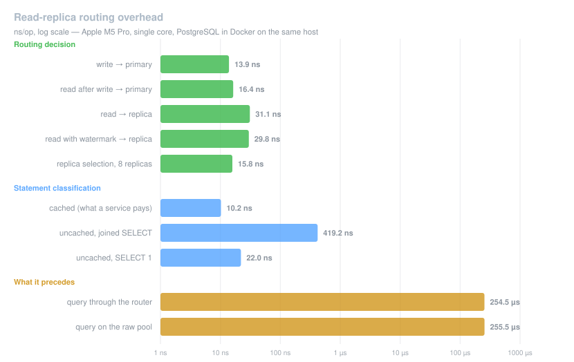

# 1. Read-replica routing

Date: 2026-08-19

## Status

Accepted

## Context

The driver opens one `*pgxpool.Pool` from a single DSN (`STORE_POSTGRES_URI`)
and hands it to callers through `db.Conn[*pgxpool.Pool]`. Every statement —
read or write — lands on the primary. A service whose reads outgrow its writes
has no way to spend a replica on the problem without building the routing
itself, and every service that builds it builds a different one.

Adding a replica naively does not work. Streaming replication is asynchronous:
a read issued milliseconds after a write can reach a standby that has not
replayed that write yet, and the caller sees a row that should exist and does
not. The guarantee being violated has a name — *read-your-writes*, one of the
four session guarantees of Terry et al. (PDIS '94).

So the problem is not "open a second pool". It is: decide, per statement,
whether a replica may answer it, and know when it may not. That splits into
classification (which statements are eligible at all), in-request consistency
(a request must read its own writes), and cross-boundary consistency (the
guarantee must survive an HTTP round trip or a queue hop, neither of which
carries a `context.Context`).

- [Don't add a read replica until you've read this](https://incident.io/blog/dont-add-a-read-replica-until-youve-read-this)
- [Jepsen: consistency models](https://jepsen.io/consistency)
- [PostgreSQL: Hot Standby](https://www.postgresql.org/docs/current/hot-standby.html)

## Architecture



Across a boundary the guarantee travels as a token, because a `context.Context`
does not:

```mermaid
sequenceDiagram
    participant C as Client
    participant W as Writer
    participant P as Primary
    participant R as Reader
    participant S as Replica

    C->>W: POST /orders
    W->>P: INSERT ...
    Note over W: context tainted;<br/>later reads stay on the primary
    W->>P: pg_current_wal_insert_lsn()
    P-->>W: 16/B374D848
    W-->>C: 201, X-Read-LSN: v1:…:3:16/B374D848:…

    C->>R: GET /orders (echoes the token)
    R->>R: replay LSN >= 16/B374D848 ?
    alt replica caught up
        R->>S: SELECT ...
    else still behind
        R->>P: SELECT ...
    end
```

## Decision

Routing lives inside this package, behind a `Router` that is opt-in, additive,
and conservative by default. Without `STORE_POSTGRES_REPLICA_URI` there is no
second pool, no poller goroutine, and no behavioural change.

**`GetConn()` keeps returning the primary pool.** `db.Conn[*pgxpool.Pool]` is
public API of a public SDK and downstream consumers are invisible from this
repository. The router is reached through `postgres.RouterFrom(store)`,
mirroring how `postgres.With(...)` is already the driver-owned way to pass
options.

**Statements are classified by a byte scanner, and doubt routes to the
primary.** A prefix check cannot do this: `SELECT nextval(...)`,
`SELECT ... FOR UPDATE` and `WITH x AS (DELETE ...) SELECT` are all writes,
and nested block comments and dollar-quoted bodies defeat regexes. incident.io
reached the same conclusion and replaced their prefix heuristic with a
tokenizer. Session-scoped statements (`SET`, `PREPARE`, `DISCARD`) are treated
as writes: run on a replica they configure a session the following statements
never see, which is worse than an error. `SERIALIZABLE` read-only transactions
stay on the primary because a hot standby rejects that isolation level.

**Two consistency mechanisms, one per boundary.**

Within a request, a taint flag: a `*Tracker` behind a context value, shared by
pointer so a write in any goroutine is visible to all of them. After a write,
every later read on that context goes to the primary. No WAL position is needed
— the primary is current by definition.

Across a boundary, a WAL watermark: `pg_current_wal_insert_lsn()` captured once
after the write, compared against the standby's `pg_last_wal_replay_lsn()`.
A background poller samples the standby every 250 ms, so the hot path issues no
extra query. `insert_lsn` rather than `flush_lsn` because it errs ahead of our
commit record, never behind it. Lag is measured in **bytes**: a replica can
close five minutes of lag in seconds or fail to close thirty seconds of it, so
elapsed time is a poor predictor of readiness.

- [PostgreSQL: WAL and recovery control functions](https://www.postgresql.org/docs/current/functions-admin.html)
- [PostgreSQL: pg_lsn type](https://www.postgresql.org/docs/current/datatype-pg-lsn.html)
- [Brandur Leach: scaling reads with LSN-gated replica selection](https://brandur.org/postgres-reads)
- [GitLab: scaling the GitLab database](https://about.gitlab.com/blog/scaling-the-gitlab-database/)
- [PostgreSQL 19: WAIT FOR LSN](https://rednafi.com/system/wait-for-lsn/)

**A watermark crossing a process boundary is a `Token`, not a bare LSN** —
`v1:<system-id>:<timeline>:<lsn>:<unix-millis>`. After a failover the standby
is promoted and a new timeline starts; an LSN minted on the old one names a
byte offset that either never existed on the new primary or now holds unrelated
records. Compared against the new replay position it is wrong in both
directions: it can pin every read to the primary forever, or report "caught up"
for content that never replicated. Carrying the lineage lets a foreign token be
discarded, which is the only correct response.

- [PostgreSQL: log-shipping standby servers, promotion and timelines](https://www.postgresql.org/docs/current/warm-standby.html)

**HTTP carries the token on the wire, not in server memory.** A mutating
response sets `X-Read-LSN`, optionally also a `__Host-`-prefixed cookie so
browsers echo it without client changes. This is stateless and therefore
correct across pods and across a rolling deploy. incident.io stamped the
watermark onto the actor's user row; a generic SDK cannot assume such a row, so
a `Watermarks` interface is provided and an in-memory implementation ships
**unwired** — with N pods and no session affinity it helps one request in N,
non-deterministically, which is worse than not helping because it looks correct
in a single-pod staging environment.

- [RFC 6265bis: cookie name prefixes](https://datatracker.ietf.org/doc/draft-ietf-httpbis-rfc6265bis/)
- [Makara: stickiness context, a timestamp until which a proxy is stuck](https://github.com/instacart/makara#stickiness-context)

**The queue consumer waits briefly rather than nacking.** The publisher stamps
the token into `message.Metadata`, following the existing `otel_trace_id`
convention; the subscriber waits inline up to 250 ms before returning a typed
error. An immediate nack feeds the existing retry middleware, and with
`MAX_RETRIES=3` a message early by 40 ms exhausts its retries during a
one-second replica hiccup and lands in the DLQ as though it were malformed — a
consistency feature manufacturing dead letters. On Kafka the nack buys nothing
anyway: the same message is redelivered after a sleep without advancing the
offset. The wait is bounded because a standby resolving a query conflict can
freeze replay for up to `max_standby_streaming_delay`.

- [Watermill: middlewares](https://watermill.io/docs/middlewares/)
- [PostgreSQL: replication configuration](https://www.postgresql.org/docs/current/runtime-config-replication.html)

**A gRPC hop carries the token in metadata, both ways.** The forward direction
is the queue case in synchronous clothing: the caller wrote, then called, so its
watermark rides out and gates the callee's reads. The return direction has no
equivalent in the other transports and matters just as much — a callee that
wrote on the caller's behalf hands its own watermark back in the trailer, so the
caller's later reads do not run behind work it asked for. The trailer is read
even when the call failed, because an RPC can return an error after part of its
work has committed.

**Failures degrade toward the primary, and topology changes are not retried.**
An error surfacing through `pgx.Rows` is never retried elsewhere — `Rows`
reports lazily, after the caller may already have scanned rows, so re-running
would duplicate them invisibly. Only `pgconn.SafeToRetry` permits a fallback.
A standby whose `pg_is_in_recovery()` turns false was promoted; that is a
topology change, so the node is quarantined for the process lifetime rather
than retried. `recovery_min_apply_delay` is checked at `Init` and refuses to
enable the gate, because a deliberately delayed standby can never satisfy a
fresh watermark.

- [pgx: pgconn.SafeToRetry](https://pkg.go.dev/github.com/jackc/pgx/v5/pgconn#SafeToRetry)

**Capturing the position costs a round trip, and `InTx` removes it inside a
transaction.** The read has to happen after the commit, so through `pgx.Tx` it
is necessarily a second round trip — `Commit` sends `COMMIT` on its own.
`Router.InTx` owns the transaction lifecycle and pipelines the two through the
simple protocol's multi-statement form, `commit; select
pg_current_wal_insert_lsn()::text`, measured at 438µs against 507µs for the
separate form. It is the one place the driver steps around pgx's transaction
type, which is why it is a distinct entry point rather than a change to what
`BeginTx` returns: the risky code is one branch, in one function, that owns the
connection it borrowed.

### Fit with DDD and CQRS

A layered codebase makes this easier, not harder — the read/write split the
router needs is already there — but two rules have to hold, and neither follows
from the code.

`Router` implements the same surface as `*pgxpool.Pool`, so it lives entirely
in the infrastructure layer. Domain and application code never sees it; one
field in a repository adapter changes type. Under CQRS the tracker belongs on
the bus rather than on HTTP, because the bus already knows which side of the
split a message is on: a command handler's context gets a tracker and taints
itself on the first write, a query handler's context gets `Stale`. The HTTP
middleware is then only needed at the boundary with the client.

**The write side must be pinned to the primary, explicitly.** Rehydrating an
aggregate from a replica yields a stale event stream, and the version computed
from it is the version the next append checks against — a lost update that no
error reports. The same applies to any write-side repository and to the outbox.
The classifier catches part of this on its own (`SELECT ... FOR UPDATE`,
`nextval`) but not the dangerous part: rehydration looks exactly like an
ordinary `SELECT`. So aggregate and event-store reads call `OnPrimary`.

**The unit of work must be wired in**, with
`postgres.WithTxLookup(uow.FromContext)`. Without it a repository called inside
a transaction runs on a different connection — outside that transaction,
without its locks, and able to deadlock against it. Where a transaction is the
aggregate boundary, this is the most damaging way to use the router, so the
hook is not optional.

What ends up where:

| layer | pool | why |
|---|---|---|
| query handlers, read models | replica | staleness is acceptable by definition |
| projections consuming events | replica, behind the gate | the queue middleware waits for the event's own writes |
| command handlers | primary | the taint arranges it |
| aggregates, event store, outbox | primary, explicitly | version checks must not read behind |

### Alternatives rejected

- **`GetConn()` returns the router when replicas are configured.** Transparent,
  but breaks every existing `db.Conn[*pgxpool.Pool]` caller and makes the
  primary pool unreachable.
- **Route in each application.** What happens today: the classifier is
  duplicated per service and the cross-boundary half never gets built, because
  it is the expensive half.
- **Delegate to a proxy (pgpool-II).** A proxy sees SQL but not the
  application's unit of work, so read-your-writes still needs the same context
  and token plumbing — which is most of the work. GitLab rejected pgpool for
  the same reason: routing decoupled from the application, driven by parsing
  SQL, with no sticky connections. Two routers for one decision do not
  compose, so a proxy that balances is not a supported deployment.
- **Bare LSN across boundaries.** Simpler wire format, silent failure after a
  failover, at the worst possible moment.
- **Wait on the replica instead of falling back (`WAIT FOR LSN`).** Postgres 19
  can block a standby session until it has replayed a given LSN, which would
  turn "behind, go to the primary" into "behind, wait here". Not adoptable yet:
  the command lands in 19 — the stored-procedure form was reverted from both 17
  and 18 — so it does not exist on any released server, and the driver must
  work on the versions services actually run. It is also constrained where the
  gate is not: top-level statement only, outside a transaction, and not under
  `REPEATABLE READ` or higher, so it cannot cover reads inside `InTx`. Worth
  revisiting as an opt-in strategy once 19 is GA, alongside the existing
  primary fallback rather than in place of it.

## Measured outcome

At a fixed offered load — the same ~1500 requests in both modes, one replica,
each node capped at one CPU — the primary serves substantially fewer
transactions, and read latency does not move:

| read mix | primary txns without routing | with routing | offload |
|---|---|---|---|
| 90% | 1555 | 392 | 75.7% |
| 70% | 1858 | 1093 | 49.8% |
| 50% | 2123 | 1540 | 32.0% |



Two honest limits on that number. The ceiling is arithmetic: every request
reads, write requests taint themselves and bring their own read back to the
primary, so at a read share of `r` at most `r/(2−r)` can leave. And offload is
not throughput — with a single replica a read-heavy mix relocates the
bottleneck rather than removing it, which is why the claim here is capacity on
the primary and nothing more.

The routing decision itself does not register against a query: 14–31ns with no
allocation, against a 255µs round trip.



## Consequences

+ Reads move off the primary without each service reinventing the routing.
+ Defaults are conservative: a read whose context carries no tracker goes to
  the primary, so adopting the driver update changes nothing until opted into.
+ The failure modes that are hard to debug — failover, promotion, deliberate
  apply delay — are detected explicitly instead of surfacing as intermittent
  missing rows.
- The driver grows a classifier, a poller goroutine, a router implementing
  thirteen pgx methods, and two middlewares.
- `Router` is not a drop-in for `*pgxpool.Pool` in every respect: `Stat()`
  cannot merge across pools (`pgxpool.Stat` has only unexported fields), and
  `Acquire` hands out a raw connection the router cannot follow.
- A replica DSN pointing at a load balancer in front of several standbys breaks
  the gate — the probe describes one node, the read reaches another. One pool
  must mean one endpoint.
- Writes issued through a second pool or a raw `database/sql` handle do not set
  the taint; `Router.MarkWritten(ctx)` is the escape hatch.
- When the probe fails while the standby still serves reads, the gate opens and
  reads may go stale. A deliberate trade for availability, compensated by
  failing startup if the probe does not work at boot, and it must be alerted on.
